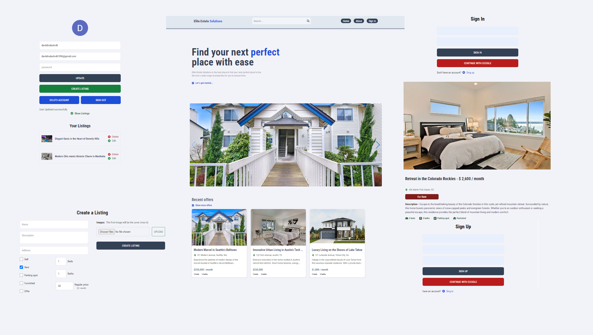

# Real Estate Webb App

### Table of Contents

- [Prerequisites](#Prerequisites)
- [Tech Stack](#Tech-Stack)
- [Interaction](#Interaction)
- [Screenshot](#Screenshot)
- [Links](#Links)
- [Getting Started](#Getting-Started)
- [Deployment](#Deployment)
- [Structure](#Structure)
- [Author](#Author)

### Prerequisites

-  _npm: Node Package Manager for JavaScript_
-  _Vite: Frontend build tool for modern web development_
-  _JavaScript: Web development language._

#

### Tech Stack

-  _Node.js: JavaScript runtime environment_
-  _Express: Minimalist web framework for Node.js_
-  _Tailwind Css: Utility-first framework for efficient, responsive web styling._
-  _Mongoose: MongoDB object modeling for Node.js._
-  _JWT: JSON Web Token for authentication_
-  _bcrypt: Password hashing library for security._
-  _Firebase: Scalable backend services, authentication, and real-time database for web apps._

### Interaction

Users should be able to:

Authentication:

- Sign up securely with email and password.
- Log in using Google Authentication.

Profile Management:

- Edit personal information.
- Change profile picture.
- Delete or edit user profile.

Real Estate Operations:

- Add new property listings.
- Edit existing property details.
- Delete property listings.

Search and Sort:

- Search properties based on price and features.
- Sort properties by price and listing time.

Image Management:

- Add images to property listings.
- Edit or delete images.

### Screenshot



### Links

- Solution URL: [Add solution URL here](https://github.com/DavitDvalashvili/real-estate-web-app)
- Live Site URL: [Add live site URL here](https://real-estate-web-app-client.vercel.app)

### Getting Started

1. First of all you need to clone app repository from github:

```
git clone https://github.com/DavitDvalashvili/real-estate-web-app.git
```

2. Next step requires install all the dependencies.

```
npm install
```

3. To see project in action

```
npm run dev
```

### Deployment

Before every deployment you need to create build file.

```
npm run build
```

after this you can use this file to deploy project on server.

## Structure

```
|-- api
| |-- controllers
| |-- models
| |-- routes
|-|-- utils
|-- index.js
|-- client
| |-- public
| | |-- readme
| |--src
| | |--assets
| | | |-- components
| | | |-- pages
| | |-- redux
| | | |-- user
| | |-- app.js
| | |-- main.js
| | |-- index.css
| |--index.html

```

### Author

- Github profile - [Add your name here](https://github.com/DavitDvalashvili)
- Linkedin profile - [Add your name here](https://www.linkedin.com/in/davit-dvalashvili-0421b6253)
- Email - [@your_username](davitdvalashvili1996@gmail.com)
